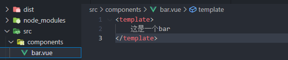
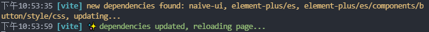

# 自动挡

## 创建

### 分布创建

```sh
# 使用npm包管理器
npm create vite@latest

# 使用yarn
yarn create vite

# 使用pnpm
pnpm create vite
```

### 一步创建

```sh
# npm 6.x
npm create vite@latest my-vue-app --template vue

# npm 7+, extra double-dash is needed:
npm create vite@latest my-vue-app -- --template vue

# yarn
yarn create vite my-vue-app --template vue

# pnpm
pnpm create vite my-vue-app -- --template vue
```

## 下载模块

```sh
npm install
```

## 运行

```sh
# dev 为package.json里配置的"dev"
npm run dev
```

# 手动挡

## 初始化包信息

```sh
# -y代表快速初始化
npm init -y
```

得到package.json

### package.json

```json
{
  "name": "vite-first", // 项目名
  "version": "1.0.0", // 版本
  "description": "一个简单的 vite + vue 项目", // 项目描述
  "main": "scr/main.js", // 设置软件包的入口点, 当在应用程序中导入此软件包时，应用程序会在该位置搜索模块的导出
  "scripts": { // 一些用于执行的脚本 如 npm run dev
    "dev": "vite",
    "build": "vite build"
  },
  "keywords": [], // 此属性包含与软件包功能相关的关键字数组
  "author": "Mr.wu", // 作者信息 name email url
  "license": "MIT", // 开源协议
  "devDependencies": { // 开发环境依赖
    "vite": "^2.8.6",
    "vue": "^3.2.31",
    "vue-router": "^4.0.14"
  },
  "dependencies": { // 通用依赖
    "@vitejs/plugin-vue": "^2.2.4"
  }
}
```

## 安装相关依赖

```sh
# 安装vite依赖
# -D代表开发环境依赖
npm i vite [-D]

#安装vue依赖
npm i vue [-D]
```

安装依赖时会自动创建 ``node_modules``文件夹 和 ``package-lock.json``文件

## 创建 index.html

```html
<!DOCTYPE html>
<html>
<head>
    <meta charset='utf-8'>
    <meta http-equiv='X-UA-Compatible' content='IE=edge'>
    <title>Page Title</title>
    <meta name='viewport' content='width=device-width, initial-scale=1'>
</head>
<body>
    // 挂载点
    <div id="app"></div> 
    // type="module" 使用ES-Modules规范
    // src="./src/main.js" 设置入口
    <script type="module" src="./src/main.js"></script> 		
</body>
</html>
```

### 创建src目录并创建main.js和App.vue

main.js

```js
import { createApp } from "vue"
import App from './App.vue'

const app = createApp(App)

app.mount('#app')
```

App.vue

```vue
<template>
    你好
</template>
```

此时不能直接运行,需要下载插件

## 下载插件

因为浏览器不能直接解析.vue文件

```sh
npm i @vitejs/plugin-vue
```

创建 vite.config.js

```js
import { defineConfig } from "vite"
import Vue from '@vitejs/plugin-vue'

export default defineConfig({
    plugins:[Vue()]
})
```

# 配置路由

## 下载路由插件

```sh
npm i vue-router
```

## 在src目录下创建plugins文件夹并创建router.js

plugins名字任意,位置任意

router.js

```js
import { createRouter, createWebHistory } from "vue-router"

const router = createRouter({
    routes:[
        {
            path: '/',
            name: 'home',
            component: () => import("../views/home.vue")
        },
        {
            path: '/about',
            name: 'about',
            component: () => import('../views/about.vue')
        }
    ],
    history:createWebHistory()
})

export default router
```

## 在main.js里面注册

```js
import router from "./plugins/router"

app.use(router)
```

# 安装pinia

## 下载pinia插件

```sh
npm i pinia
```

## 在src目录下的plugins文件夹创建pinia.js

文件名任意,位置任意

pinia.js

```js
import { createPinia } from 'pinia'

const pinia = createPinia()

export default pinia
```

## 在src目录下创建stores文件夹

### 例:在stores目录下创建counter.js计算.js

```js
import { defineStore } from "pinia";

// 第一种写法
export const userCounterStore = defineStore('counter',{
    // state: () => ({
    //		num:1,
    //		name:wyz
	//})
    state(){
        return{
            num: 1
        }
    },
    getters:{

    },
    actions:{
        inc(){
            this.num++
        }
    }
})

//// 函数写法,setup组件
export const useCounterStore = defineStore('counter', () => {
  const count = ref(0)
  function increment() {
    count.value++
  }

  return { count, increment }
})
```

### 使用counter.js

home.vue

```vue
// script多种写法 1 setup语法糖
<script setup>
import { userCounterStore } from "../stores/counter"

const counter = userCounterStore()
</script>

// script多种写法 2
<script>
import { userCounterStore } from "../stores/counter"
export default{
    setup(){
        const counter = userCounterStore()
    }
}
</script>

//多种调用方法
<template>
    <div @click="counter.inc()">{{counter.num}}</div>
	<div @click="counter.inc()">{{counter.$state.num}}</div>
</template>


```


# 按需引入

## 下载插件

```sh
npm i unplugin-vue-components -D
```

## 自定义组件 (一般放在components文件夹下)



vite.config.js

```js
import { defineConfig } from "vite"
import Vue from '@vitejs/plugin-vue'
import Components from 'unplugin-vue-components/vite'

export default defineConfig({
    plugins:[
        Vue(),
        Components()
    ]
})
```

引入前:

```vue
<script setup>
import bar from '../components/bar.vue'
</script>

<template>
    <bar></bar><br/>
</template>
```

引入后:

```vue
<script setup>
</script>

<template>
    <bar></bar><br/>
</template>
```


## 下载的外部组件(element-plus,naive-ui等)

下载element-plus和naive-ui

```sh
npm i element-plus -D

npm i naive-ui -D
```

vite.config.js

```js
import { defineConfig } from "vite"
import Vue from '@vitejs/plugin-vue'
import Components from 'unplugin-vue-components/vite'
import { ElementPlusResolver, NaiveUiResolver } from 'unplugin-vue-components/resolvers'

export default defineConfig({
    plugins:[
        Vue(),
        Components({
            resolvers: [
                ElementPlusResolver(),
                NaiveUiResolver()
            ]
        })
    ]
})
```

home.vue

```vue
<script setup>
</script>

<template>
    <bar></bar><br/>
    <el-button type="success">element-plus按钮</el-button>
    <n-button>naive-ui按钮</n-button>
</template>
```

首次npm run dev时会等待加载依赖




## 下载的插件的元素(vue,vue-router,pinia等)

下载另一个插件

```sh
npm i -D unplugin-auto-import
```

使用前:home.vue

```vue
<script setup>
import { ref } from 'vue'

const a = ref(20)
const inc = () => a.value++
</script>

<template>
    <button @click="inc()">{{a}}</button>
</template>
```

使用方法:vite.config.js

```js
import { defineConfig } from "vite"
import AntoImport from 'unplugin-auto-import/vite'
export default defineConfig({
    plugins:[
        Vue(),
        AntoImport({
            imports: [
                'vue',
                'vue-router',
                'pinia'
            ]
        }),
        Components({
            resolvers: [
                ElementPlusResolver(),
                NaiveUiResolver()
            ]
        })
    ]
})
```

使用后:home.vue,pinia.js等

```vue
<script setup>

const a = ref(20)
const inc = () => a.value++
</script>

<template>
    <button @click="inc()">{{a}}</button>
</template>
```

pinia.js

```js
// import { createPinia } from 'pinia' // 下载插件后此语句可以省略

const pinia = createPinia()

export default pinia
```


## 自身创建的模块(views,plugins,stores等)

unplugin-auto-import不支持自动引入自身模块,但是提供了一个resolvers,你可以自己动手添加目录

vite.config.js,目前只支持ElementPlusResolver()

```js
import AntoImport from 'unplugin-auto-import/vite'
export default defineConfig({
    plugins:[
        Vue(),
        AntoImport({
            imports: [
                'vue',
                'vue-router',
                'pinia'
            ],
            resolvers:[ElementPlusResolver()]
        }),
        Components({
            resolvers: [
                ElementPlusResolver(),
                NaiveUiResolver()
            ]
        })
    ]
})
```

可以下载另一个插件以让unplugin-auto-import支持

```js
npm i vite-auto-import-resolvers -D
```

vite.config.js

```js
//esmodule 语法
//not commonjs
import { resolve } from 'path'
import { dirResolver,DirResolverHelper } from "vite-auto-import-resolvers"

export default defineConfig({
    resolve:{
        // 设置别名,必须
        alias:{
            '~/':`${resolve(__dirname, 'src')}/`
        }
    },
    plugins:[
        Vue(),
        DirResolverHelper(),
        AntoImport({
            imports: ['vue','vue-router','pinia'],
            resolvers:[
                ElementPlusResolver(),
                dirResolver(),
                dirResolver(
                    {
                        target:'stores',// 设置stores目录为自动按需引入
                    }
                )]
        }),
        Components({
            resolvers: [
                ElementPlusResolver(),
                NaiveUiResolver()
            ]
        })
    ]
})
```

此时使用stores目录下的counter.js

```js
import { defineStore } from "pinia";

export default defineStore('counter',{ // 只支持export default导出语法,调用与文件名绑定
    state: () =>({
        num:1
    }),
    getters:{

    },
    actions:{
        inc(){
            this.num++
        }
    }
})
```

习惯将命名为counterStore,所以将counter.js改名为counterStore.js,通过counterStore调用

此时home.vue

```vue
<script setup>
const counter = counterStore() // 直接调用,counterStore为文件名即counterStore.js
</script>

<template>
    <button @click="counter.inc()">{{counter.num}}</button>
</template>
```
